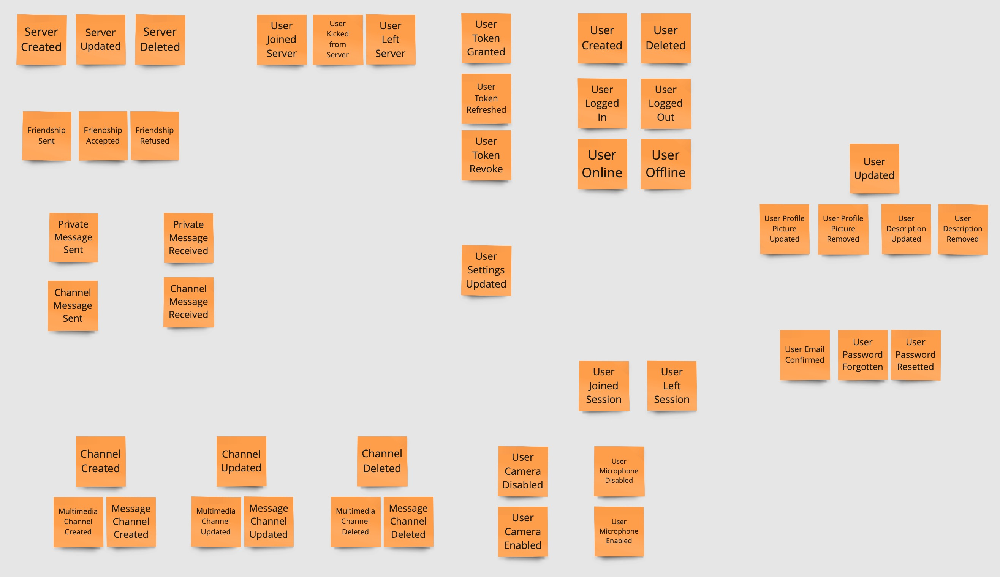
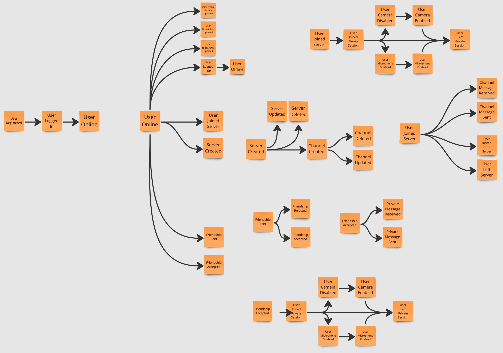
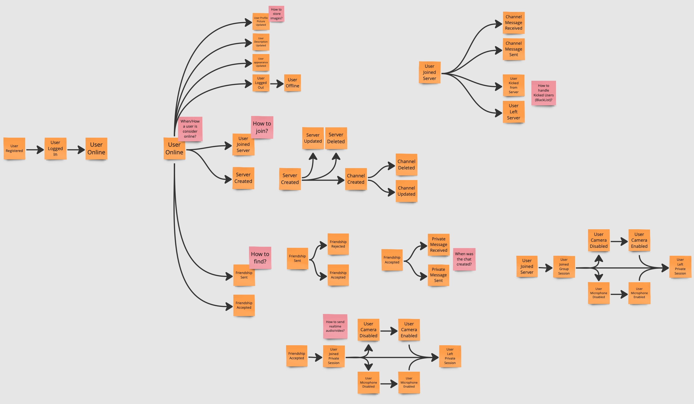
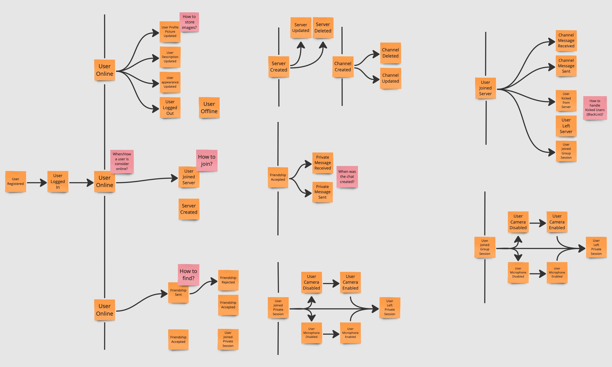
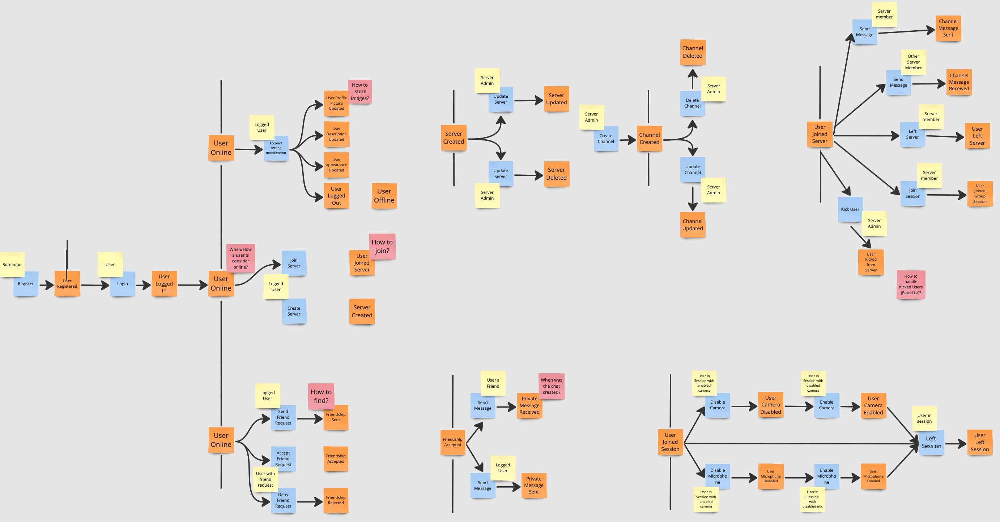
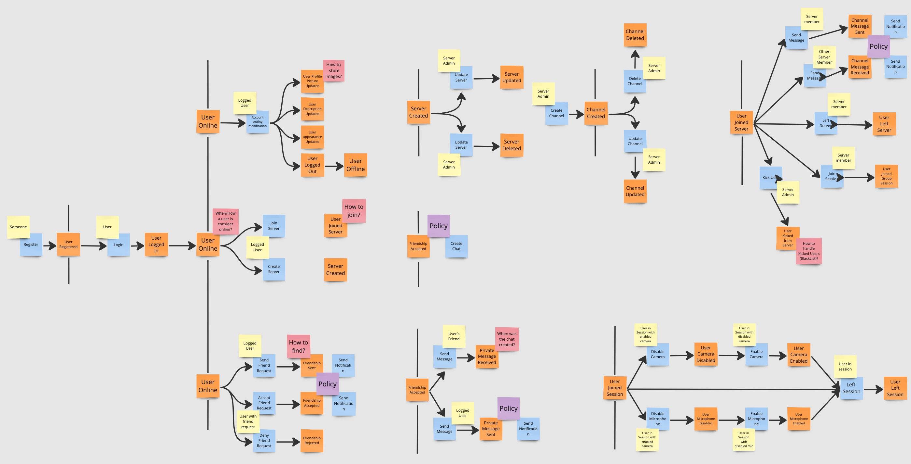
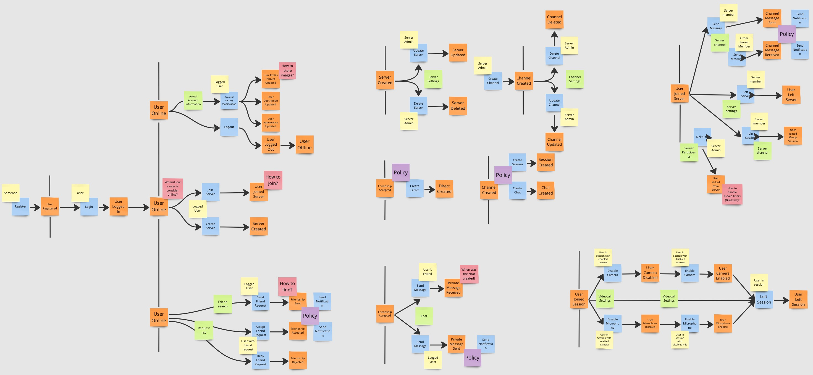
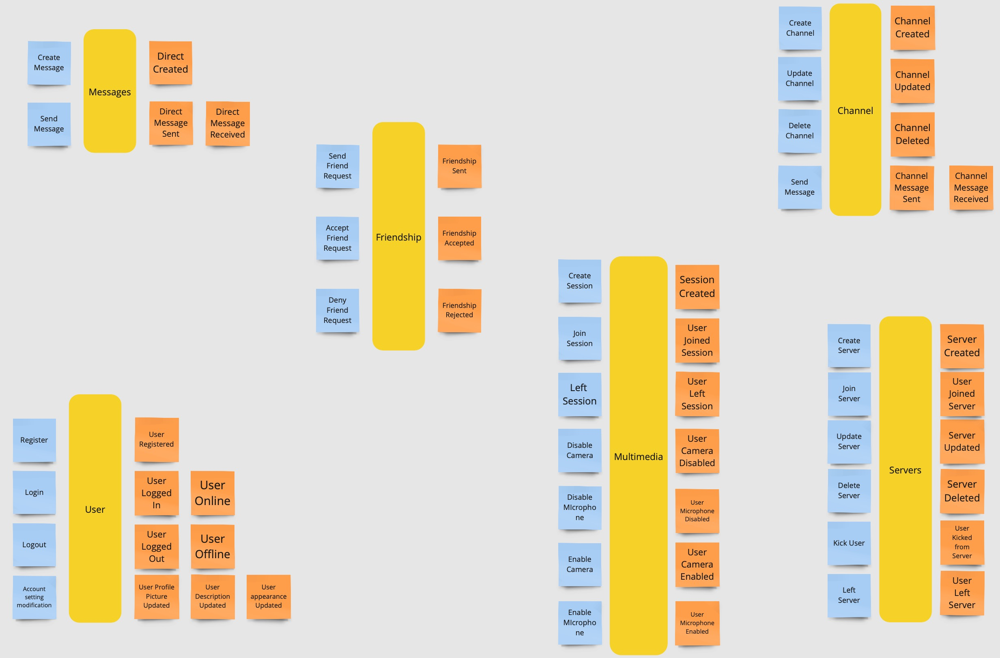
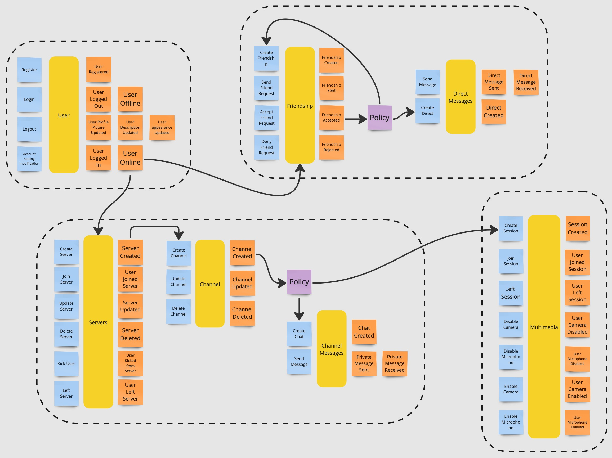

# Knowledge Crunching

The knowledge crunching phase is the first step of the project, where the team members get to know the domain related to the project itself.
This phase is crucial for the success of the project, as it allows the team to understand the project's requirements and constraints.

Our knowledge crunching session have been realized using [Event Storming](https://www.eventstorming.com) approach, using a collaborative board and post-it notes to identify the main components and interactions related to the system.
The process is iterative and all steps are presented in the following sections.

[Miro](https://miro.com/) platform has been used for the sessions.

## Event Storming

### Unstructured Exploration

During the first iteration, each team member write possible domain events that could happen in the system, at put it on the board, without any specific order.

### Timeline

Domain events are now organized in the order in which they occur in the business domain.

### Pain Points

The team tries to identify pain points in the system, spotting possible process that require
attention.

### Pivotal Points

The team identifies pivotal points in the system, where the system could be split in different bounded contexts.

### Commands

The team now identifies and describes the command that trigger the event or flow of events,
describing the system’s operations.
In addition, has been specified also the actor whose trigger the command.

### Policies

The team identifies the policies, commands without an actor, that are executed within the system.

### Read Models

The team identifies the read models, a view over data within the domain that an actor uses to make a decision to execute a command.

### Aggregates

Now, once all the events and commands are represented, they are grouped into aggregates.

### Bounded Contexts

Finally, the team identifies the bounded contexts, the boundaries of the system, where each bounded context is a separate domain model.

The identified bounded contexts are:

- `Friendships`: everything related to the friendships between users and their messages.
- `Servers`: everything related to the servers and channels.
- `Users`: everything related to the users, their profiles and authentication.
- `Multimedia`: everything related to multimedia sessions.
