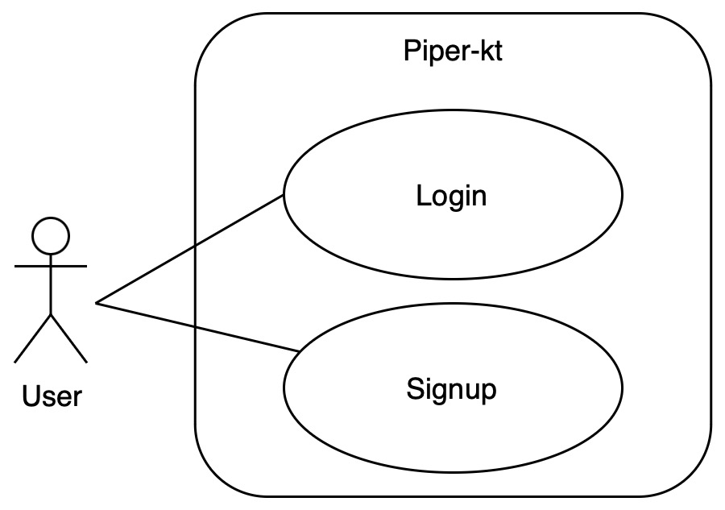
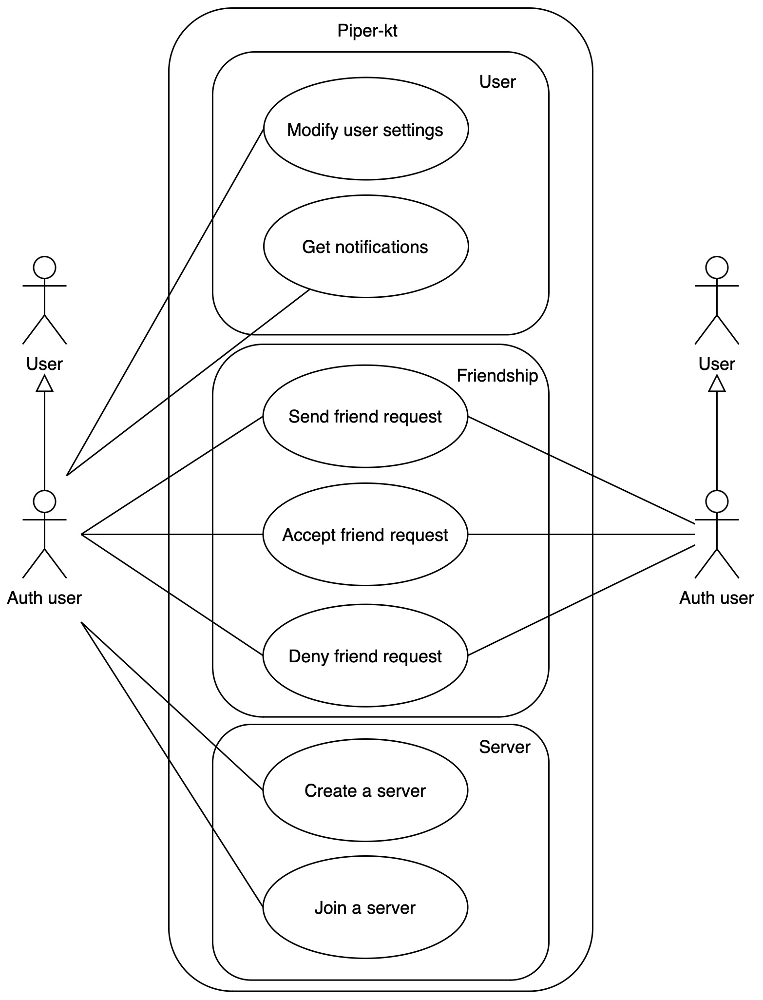
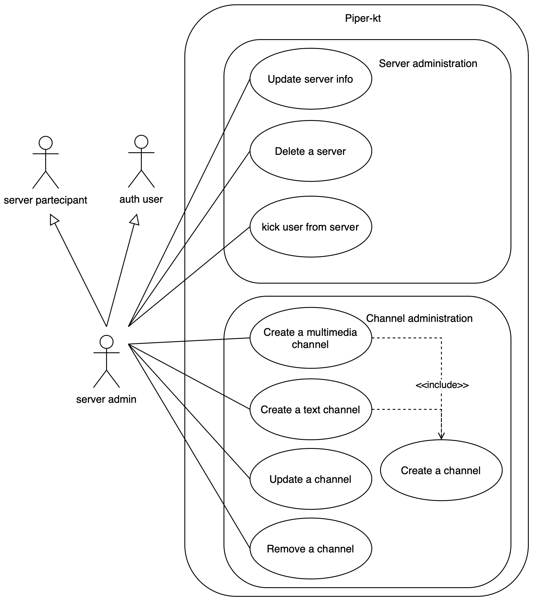
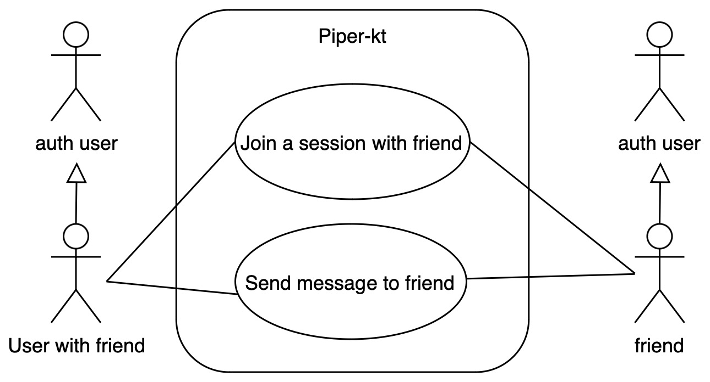
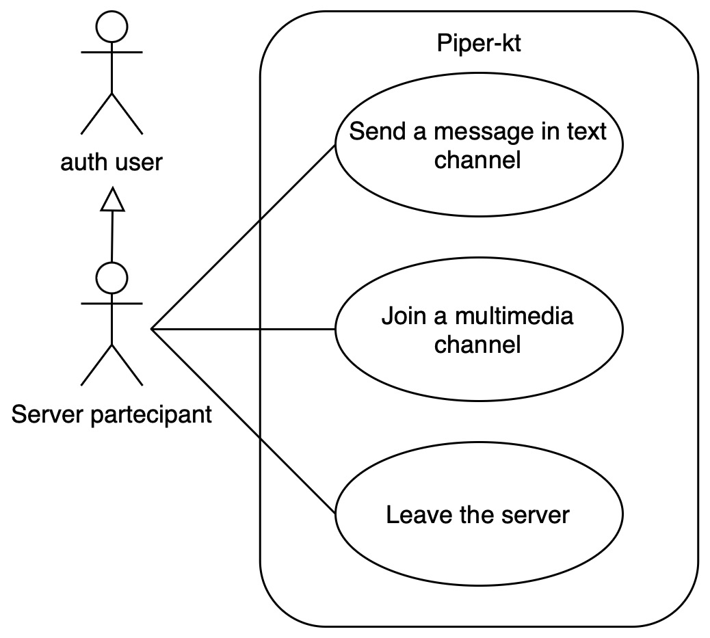
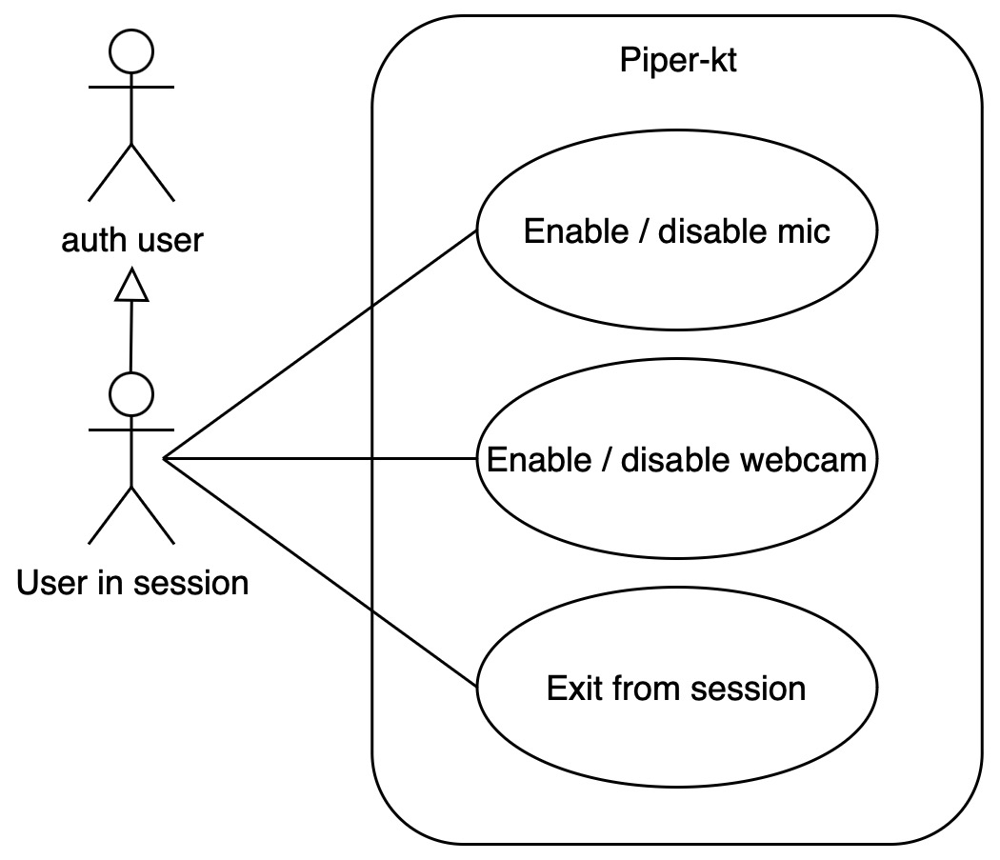

# Business Requirements

The following section describes the business requirements, what the system should able to do, of the Piper-kt project.

To capture these business requirements, we used use case diagrams and textual descriptions of them.

## User Login/Signup

A user, who accesses to Piper-kt service, should be able to:

<!-- 1. Register a new account, which requires providing a username, email, and password.
2. Access the service by authenticating with the username and password, using a previously registered account. -->

1. **Register a new account (Signup)**
    - **Actor**: User
    - **Preconditions**: The user is not registered in the system.
    - **Postconditions**: The user is registered in the system.
    - **Main Success Scenario**:
        1. The user accesses the registration page.
        2. The user fills in the registration form with the required information.
        3. The user submits the registration form.
        4. The system validates the registration information.
        5. The system creates a new account for the user.
        6. The system redirects the user to the login page.
    - **Extensions**:
        - **A1**: The user enters invalid information.
            1. The system displays an error message.
            2. The user returns to step 2 and corrects the information.
        - **A2**: The user already has an account.
            1. The system displays an error message.
            2. The user returns to step 2 and enters different information.

2. **Login**
    - **Actor**: User
    - **Preconditions**: The user is registered in the system.
    - **Postconditions**: The user is authenticated in the system.
    - **Main Success Scenario**:
        1. The user accesses the login page.
        2. The user enters the username and password.
        3. The user submits the login form.
        4. The system validates the login information.
        5. The system authenticates the user.
        6. The system redirects the user to the home page.
    - **Extensions**:
        - **A1**: The user enters invalid information.
            1. The system displays an error message.
            2. The user returns to step 2 and corrects the information.
        - **A2**: The user does not have an account.
            1. The system displays an error message.
            2. The user returns to step 2 and enters different information.

## Authenticated User

After performing authentication, a user acquires the ability to perform numerous actions, which cover different areas.
The following use cases are identified for an authenticated user:

1. **Modify User Settings**
    - **Actor**: Authenticated User
    - **Preconditions**: The user is authenticated in the system.
    - **Postconditions**: The user settings are updated.
    - **Main Success Scenario**:
        1. The user accesses the settings page.
        2. The user modifies the settings.
        3. The user saves the changes.
        4. The system updates the user settings.
        5. The system displays a success message.
    - **Extensions**:
        - **A1**: The user enters invalid information.
            1. The system displays an error message.
            2. The user returns to step 2 and corrects the information.

2. **Get Notifications**
    - **Actor**: Authenticated User
    - **Preconditions**: The user is authenticated in the system.
    - **Postconditions**: The user receives notifications.
    - **Main Success Scenario**:
        1. The system retrieves the user's notifications.
        2. The system displays the notifications to the user.
    - **Extensions**:
        - **A1**: The user has no notifications.
            1. The system does not display any notifications.

3. **Send Friend Request**
    - **Actor**: Authenticated User
    - **Preconditions**: The user is authenticated in the system.
    - **Postconditions**: The friend request is sent.
    - **Main Success Scenario**:
        1. The user enters the friendship request page.
        2. The user selects the user to send the request.
        3. The user sends the request.
        4. The system sends the request to the other user.
        5. The system displays a success message.
    - **Extensions**:
        - **A1**: The user selects an invalid user.
            1. The system does not send the request.

4. **Accept/Reject Friend Request**
    - **Actor**: Authenticated User
    - **Preconditions**: The user is authenticated in the system.
    - **Postconditions**: The friend request is accepted or rejected.
    - **Main Success Scenario**:
        1. The user accesses the friend requests page.
        2. The user selects a friend request.
        3. The user accepts or rejects the request.
        4. The system updates the request status.
        5. The system updates the user's friends list.
        5. The system displays a success message.
    - **Extensions**:
        - **A1**: The user does not have any friend requests.
            1. The system does not display any requests.

5. **Create Server**
    - **Actor**: Authenticated User
    - **Preconditions**: The user is authenticated in the system.
    - **Postconditions**: The server is created.
    - **Main Success Scenario**:
        1. The user accesses the server creation page.
        2. The user fills in the server information.
        3. The user creates the server.
        4. The system creates the server.
        5. The system adds the user as the server administrator.
        6. The system displays a success message.

6. **Join Server**
    - **Actor**: Authenticated User
    - **Preconditions**: The user is authenticated in the system.
    - **Postconditions**: The user joins the server.
    - **Main Success Scenario**:
        1. The user accesses the server list.
        2. The user enters the server id.
        3. The user joins the server.
        4. The system adds the user to the server.
        5. The system displays a success message.
    - **Extensions**:
        - **A1**: The user enters an invalid server id.
            1. The system displays an error message.
            2. The user returns to step 2 and enters a valid server id.
<!-- 
- The user now has the ability to manage his profile and is enabled to receive notifications addressed to him.
- The user can use friend request management, which includes the ability to
    - send friendship requests to other users,
    - accept requests received
    - reject requests received.
- The user has the ability to create servers or participate to servers already created. -->

## Server Admin

A user, after creating a server, becomes its **administrator**.
This allows access to management features for it, among which the following can be highlighted:

1. **Update Server Info**
    - **Actor**: Server Admin
    - **Preconditions**: The user is the server administrator.
    - **Postconditions**: The server information is updated.
    - **Main Success Scenario**:
        1. The server admin accesses the server settings.
        2. The server admin modifies the server information.
        3. The server admin saves the changes.
        4. The system updates the server information.
        5. The system displays a success message.
    - **Extensions**:
        - **A1**: The server admin enters invalid information.
            1. The system displays an error message.
            2. The server admin returns to step 2 and corrects the information.

2. **Delete Server**
    - **Actor**: Server Admin
    - **Preconditions**: The user is the server administrator.
    - **Postconditions**: The server is deleted.
    - **Main Success Scenario**:
        1. The server admin accesses the server settings.
        2. The server admin deletes the server.
        3. The system removes the server.
        4. The system displays a success message.

3. **Kick User from Server**
    - **Actor**: Server Admin
    - **Preconditions**: The user is the server administrator.
    - **Postconditions**: The user is removed from the server.
    - **Main Success Scenario**:
        1. The server admin accesses the server settings.
        2. The server admin selects the user to remove.
        3. The server admin removes the user.
        4. The system removes the user from the server.
        5. The system displays a success message.

4. **Create Channel (Text or Multimedia)**
    - **Actor**: Server Admin
    - **Preconditions**: The user is the server administrator.
    - **Postconditions**: The channel is created.
    - **Main Success Scenario**:
        1. The server admin accesses the channel creation page.
        2. The server admin fills in the channel information.
        3. The server admin creates the channel.
        4. The system creates the channel.
        5. The system displays a success message.

5. **Update Channel**
    - **Actor**: Server Admin
    - **Preconditions**: The user is the server administrator.
    - **Postconditions**: The channel is updated.
    - **Main Success Scenario**:
        1. The server admin accesses the channel settings.
        2. The server admin modifies the channel information.
        3. The server admin saves the changes.
        4. The system updates the channel information.
        5. The system displays a success message.

6. **Delete Channel**
    - **Actor**: Server Admin
    - **Preconditions**: The user is the server administrator.
    - **Postconditions**: The channel is deleted.
    - **Main Success Scenario**:
        1. The server admin accesses the channel settings.
        2. The server admin deletes the channel.
        3. The system removes the channel.
        4. The system displays a success message.

<!-- - The administrator can update the server's information or delete it.
- The administrator can remove a user from the server.
- The administrator can create channels (text or multimedia).
- The administrator can update or remove channels already created. -->

## Friends interaction

Two users, after befriending each other, have the ability to interact with each other in the following ways:

1. **Join Session with friend**
    - **Actor**: User
    - **Preconditions**: The two users are friends.
    - **Postconditions**: The users are in a multimedia session.
    - **Main Success Scenario**:
        1. The user accesses the friend's profile.
        2. The user selects the option to join a session.
        3. The system creates a multimedia session.
        4. The system adds the two users to the session.
        5. The system displays the multimedia session.

2. **Send message to friend**
    - **Actor**: User
    - **Preconditions**: The two users are friends.
    - **Postconditions**: The message is sent.
    - **Main Success Scenario**:
        1. The user accesses the chat with the friend.
        2. The user writes a message.
        3. The user sends the message.
        4. The system delivers the message to the friend.
        5. The system displays the message in the chat.

<!-- 
- Send messages within the chat between the two users.
- Participate in the multimedia session. -->

## User in a Server

A user participating in a server has the following abilities:

1. **Send message in text channel**
    - **Actor**: User
    - **Preconditions**: The user is in a server.
    - **Postconditions**: The message is sent.
    - **Main Success Scenario**:
        1. The user accesses the text channel.
        2. The user writes a message.
        3. The user sends the message.
        4. The system delivers the message to the channel.
        5. The system displays the message in the channel chat.

2. **Join a multimedia channel**
    - **Actor**: User
    - **Preconditions**: The user is in a server.
    - **Postconditions**: The user is in a multimedia session.
    - **Main Success Scenario**:
        1. The user accesses the multimedia channel.
        2. The user joins the multimedia session.
        3. The system adds the user to the session.
        4. The system displays the multimedia session.

3. **Leave the Server**
    - **Actor**: User
    - **Preconditions**: The user is in a server.
    - **Postconditions**: The user leaves the server.
    - **Main Success Scenario**:
        1. The user accesses the server settings.
        2. The user selects the option to leave the server.
        3. The system removes the user from the server.
        4. The system displays a success message.
    - **Extensions**:
        - **A1**: The user is the server administrator.
            1. The system displays an error message.
            2. The user returns to step 2 and selects a different option.

## Multimedia Session

A user in a multimedia session, either in a private one with a friend or in a channel, has the ability to: 

1. **Enable/Disable microphone**
    - **Actor**: User
    - **Preconditions**: The user is in a multimedia session.
    - **Postconditions**: The microphone is enabled or disabled.
    - **Main Success Scenario**:
        1. The user accesses the multimedia session settings.
        2. The user enables or disables the microphone.
        3. The system updates the microphone status.

2. **Enable/Disable webcam**
    - **Actor**: User
    - **Preconditions**: The user is in a multimedia session.
    - **Postconditions**: The webcam is enabled or disabled.
    - **Main Success Scenario**:
        1. The user accesses the multimedia session settings.
        2. The user enables or disables the webcam.
        3. The system updates the webcam status.

3. **Exit from Session**
    - **Actor**: User
    - **Preconditions**: The user is in a multimedia session.
    - **Postconditions**: The user exits the session.
    - **Main Success Scenario**:
        1. The user selects the option to exit the session.
        2. The system removes the user from the session.
        3. The system displays a success message.

