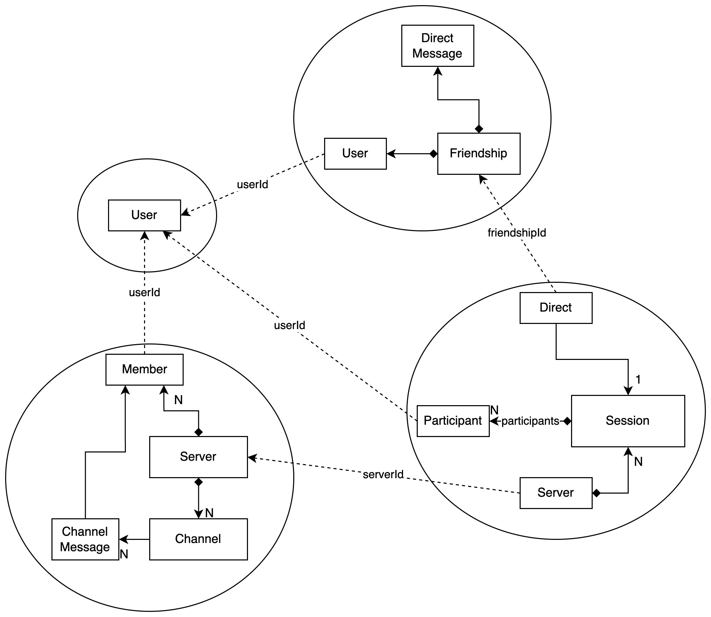

# Domain

The complete domain model is shown in the following image:

## Bounded Contexts

The system is divided into the following bounded contexts, according to the identified pivotal points:

## Users Bounded Context

The `Users` bounded context is responsible for managing the users, their profiles and authentication.

### Subdomain

TODO: Photo of the subdomain.

### Inbound Events

The `Users` bounded context doesn't receive any inbound events.

### Outbound Events

The `Users` bounded context emits the following outbound events:

- `UserRegistered`: emitted when a new user is registered.
- `UserUpdated`: emitted when a user updates their profile.
- `UserLoggedIn`: emitted when a user is authenticated.
- `UserLoggedOut`: emitted when a user logs out.

## Friendships Bounded Context

The `Friendships` bounded context is responsible for managing the friendships between users and their messages.

### Subdomain

TODO: Photo of the subdomain.

### Inbound Events

The `Friendships` bounded context doesn't receive any inbound events.

### Outbound Events

The `Friendships` bounded context emits the following outbound events:

- `FriendshipRequested`: emitted when a user requests to be friends with another user.
- `FriendshipAccepted`: emitted when a user accepts a friend request.
- `FriendshipRejected`: emitted when a user rejects a friend request.
- `NewMessageInFriendship`: emitted when a new message is sent in a friendship.

## Servers Bounded Context

The `Servers` bounded context is responsible for managing the servers and channels, including the messages sent in the channels.

### Subdomain

TODO: Photo of the subdomain.

### Inbound Events

The `Servers` bounded context doesn't receive any inbound events.

### Outbound Events

The `Servers` bounded context emits the following outbound events:

- `ServerCreated`: emitted when a new server is created.
- `ServerUpdated`: emitted when a server is updated.
- `ServerDeleted`: emitted when a server is deleted.
- `ChannelCreated`: emitted when a new channel is created in a server.
- `ChannelUpdated`: emitted when a channel is updated.
- `ChannelDeleted`: emitted when a channel is deleted.
- `NewMessageInChannel`: emitted when a new message is sent in a channel.
- `ServerUserAdded`: emitted when a user is added to a server.
- `ServerUserRemoved`: emitted when a user is removed from a server.
- `ServerUserKicked`: emitted when a user is kicked from a server.

## Multimedia Bounded Context

The `Multimedia` bounded context is responsible for managing multimedia sessions used to make video/audio calls.

### Subdomain

TODO: Photo of the subdomain.

### Inbound Events

The `Multimedia` bounded context listen to the following inbound events:

#### Server Events

- `ServerCreated`: when a new server is created.
- `ServerDeleted`: when a server is deleted.
- `ChannelCreated`: when a new channel is created in a server.
- `ChannelDeleted`: when a channel is deleted.
- `ServerUserAdded`: when a user is added to a server.
- `ServerUserRemoved`: when a user is removed from a server.
- `ServerUserKicked`: when a user is kicked from a server.

Those events are used to keep servers and channels in sync with the multimedia sessions, in order to allow users to make calls in the correct context.

#### Friendships Events

- `FriendshipAccepted`: when a user accepts a friend request.

This event is used to keep the multimedia sessions in sync with the friendships, in order to allow users to make calls to their friends.

### Outbound Events

The `Multimedia` bounded context emits the following outbound events:

- `SessionCreated`: emitted when a new multimedia session is created.
- `SessionDeleted`: emitted when a multimedia session is deleted.
- `AllowedUserAdded`: emitted when a user is allowed to join a multimedia session.
- `AllowedUserRemoved`: emitted when a user is removed from a multimedia session.
- `ParticipantJoined`: emitted when a user joins a multimedia session.
- `ParticipantLeft`: emitted when a user leaves a multimedia session.
