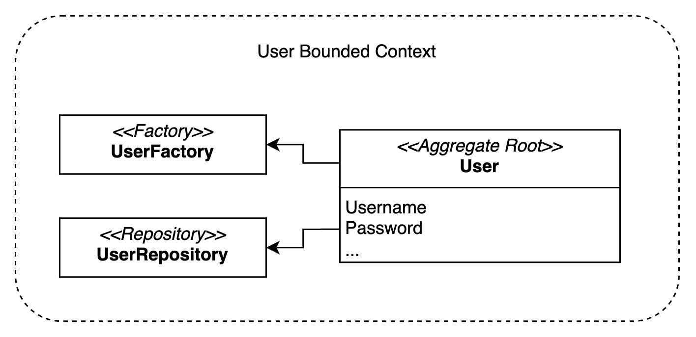
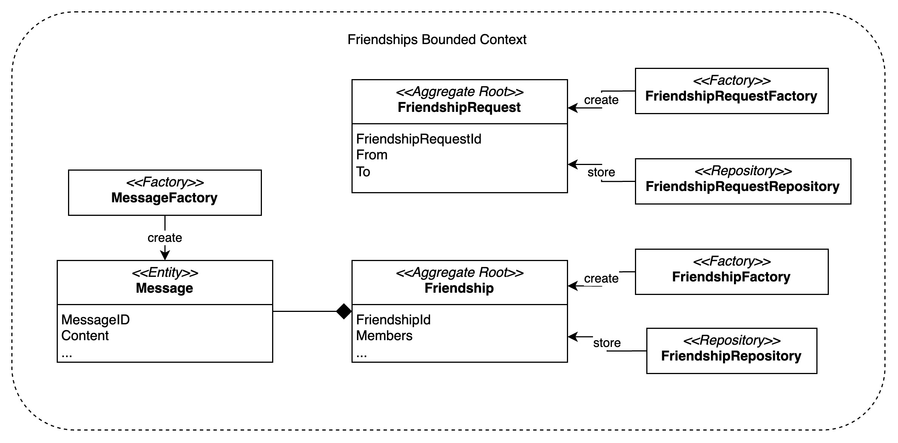
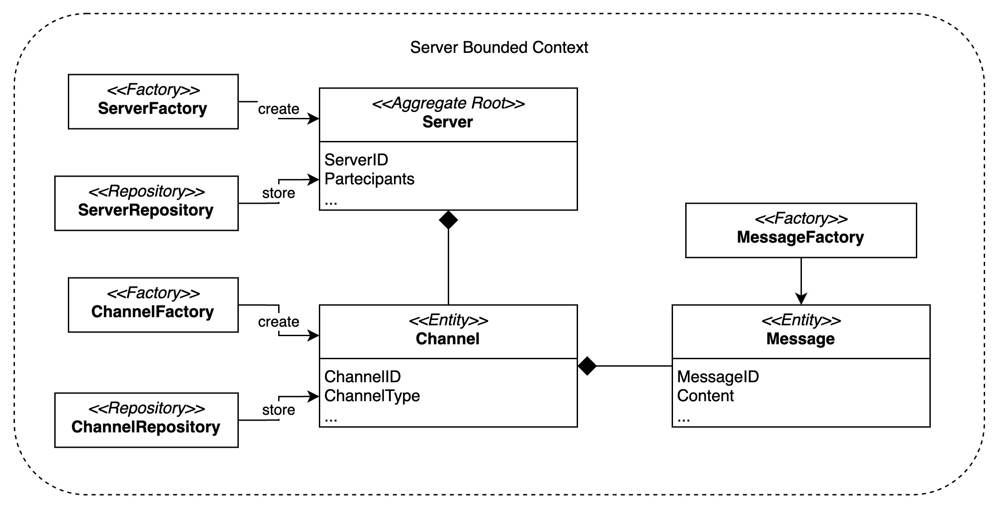

# Bounded Contexts

The system is divided into the following bounded contexts, according to the identified pivotal points:
- **Users** context
- **Friendships** context
- **Servers** context
- **Multimedia** context

Following is a detailed description of each bounded context.

## Users

The `Users` bounded context is responsible for managing the users, their profiles and authentication.

## Friendships

The `Friendships` bounded context is responsible for managing the friendships between users and their messages.

## Servers

The `Servers` bounded context is responsible for managing the servers and channels, including the messages sent in the channels.

## Multimedia

The `Multimedia` bounded context is responsible for managing multimedia sessions used to make video/audio calls.

----

# Context Map

Each bounded context is isolated, they communicate through events following the **Published Language** pattern. The following diagram shows the context map of the system.

## Users Context

The **Users context** doesn't have inbound events but it publishes events related to user registration and authentication.

### Outbound Events

- `UserRegistered`: emitted when a new user is registered.
- `UserUpdated`: emitted when a user updates their profile.
- `UserLoggedIn`: emitted when a user is authenticated.
- `UserLoggedOut`: emitted when a user logs out.

## Friendships Context

The **Friendships context** doesn't have inbound events but it publishes events related to friendship requests and messages.

### Outbound Events

- `FriendshipRequested`: emitted when a user requests to be friends with another user.
- `FriendshipAccepted`: emitted when a user accepts a friend request.
- `FriendshipRejected`: emitted when a user rejects a friend request.
- `NewMessageInFriendship`: emitted when a new message is sent in a friendship.

## Servers Context

The **Servers context** doesn't have inbound events but it publishes events related to server and channel management.

### Outbound Events
- `ServerCreated`: emitted when a new server is created.
- `ServerUpdated`: emitted when a server is updated.
- `ServerDeleted`: emitted when a server is deleted.
- `ChannelCreated`: emitted when a new channel is created in a server.
- `ChannelUpdated`: emitted when a channel is updated.
- `ChannelDeleted`: emitted when a channel is deleted.
- `NewMessageInChannel`: emitted when a new message is sent in a channel.
- `ServerUserAdded`: emitted when a user is added to a server.
- `ServerUserRemoved`: emitted when a user is removed from a server.
- `ServerUserKicked`: emitted when a user is kicked from a server.

## Multimedia Context

The **Multimedia context** has inbound events related to server and channel management to keep updated the sessions related to multimedia channels. It also listen to friendship events to create multimedia sessions related to friendships.

### Inbound Events

#### Server Events

- `ServerCreated`: when a new server is created.
- `ServerDeleted`: when a server is deleted.
- `ChannelCreated`: when a new channel is created in a server.
- `ChannelDeleted`: when a channel is deleted.
- `ServerUserAdded`: when a user is added to a server.
- `ServerUserRemoved`: when a user is removed from a server.
- `ServerUserKicked`: when a user is kicked from a server.

Those events are used to keep servers and channels in sync with the multimedia sessions, in order to allow users to make calls in the correct context.

#### Friendships Events

- `FriendshipAccepted`: when a user accepts a friend request.

This event is used to keep the multimedia sessions in sync with the friendships, in order to allow users to make calls to their friends.

### Outbound Events

- `SessionCreated`: emitted when a new multimedia session is created.
- `SessionDeleted`: emitted when a multimedia session is deleted.
- `AllowedUserAdded`: emitted when a user is allowed to join a multimedia session.
- `AllowedUserRemoved`: emitted when a user is removed from a multimedia session.
- `ParticipantJoined`: emitted when a user joins a multimedia session.
- `ParticipantLeft`: emitted when a user leaves a multimedia session.
