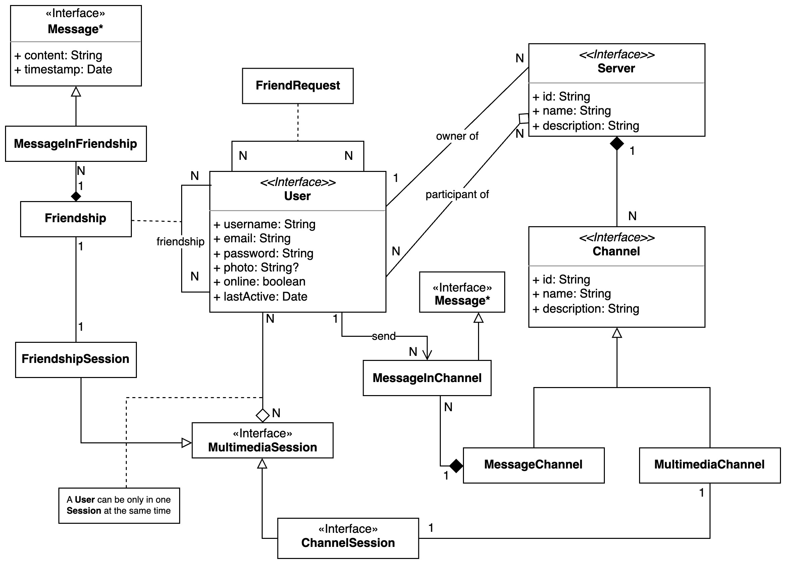
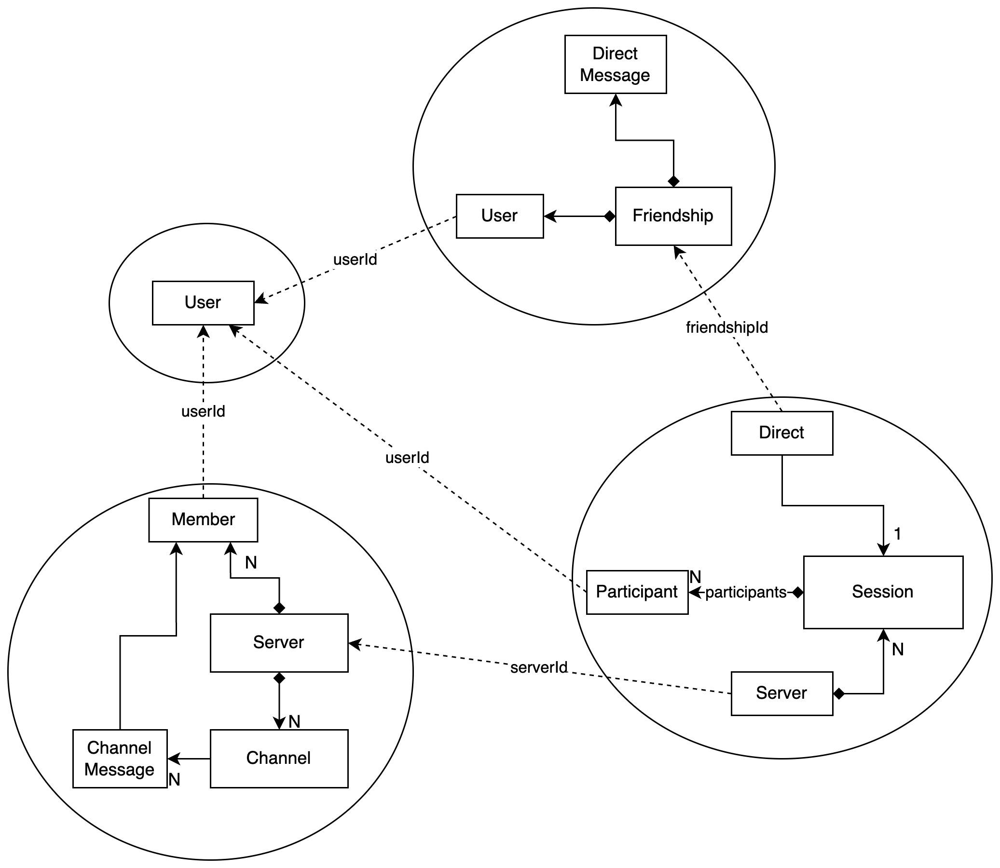

# Domain

The complete domain model is shown in the following image:

## Bounded Contexts

The system is divided into the following bounded contexts, according to the identified pivotal points:

## Users

The `Users` bounded context is responsible for managing the users, their profiles and authentication.

## Friendships

The `Friendships` bounded context is responsible for managing the friendships between users and their messages.

## Servers

The `Servers` bounded context is responsible for managing the servers and channels, including the messages sent in the channels.

## Multimedia

The `Multimedia` bounded context is responsible for managing multimedia sessions used to make video/audio calls.

