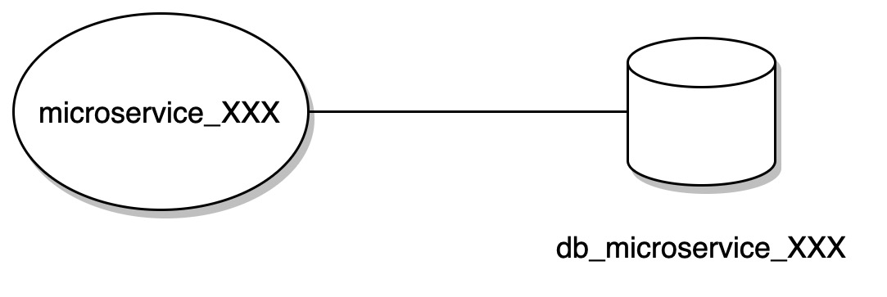
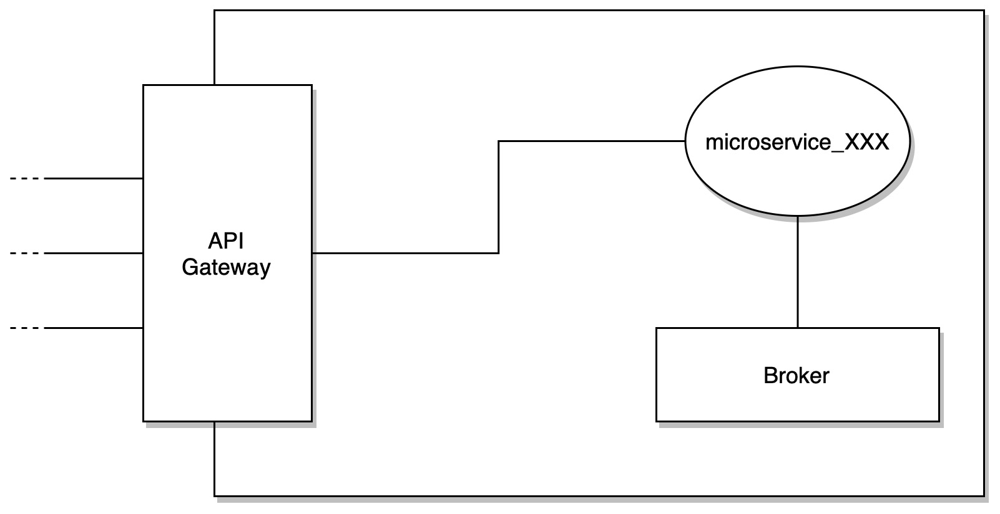
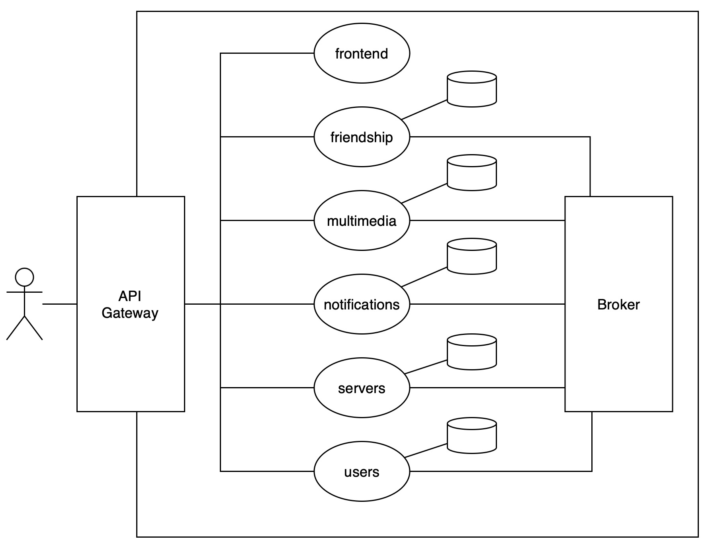

# Architecture Design

## Microservices Architecture

The architecture of the system is based on the microservices architecture pattern, in order to brake down the entire complexity into smaller parts, with high cohesion, but loosely coupled.
In addition, each microservice, if necessary, has a database, which it can access exclusively.

Each **Bounded Context** is implemented as a separate microservice.

In addition to Bounded Contexts, there are also utility microservices, in order to provide technical functionalities.

Here is the list of microservices that compose the system:

- `users-service`: responsible for managing users, authentication and authorization.
- `servers-service`: responsible for managing servers and channels.
- `friendships-service`: responsible for managing friendships between users and their messages.
- `multimedia-service`: responsible for managing sessions.
- `frontend-service`: responsible for serving the frontend application.
- `notifications-service`: responsible for managing notifications directed to users.

### Interactions

Each microservice has two main types of interactions, in order handle communication:

- **External communication**: interactions with the outside world (e.g. client requests), which are handled by the API Gateway and redirected to the appropriate microservice.
- **Internal communication**: interactions between microservices, which are handled by the Event Broker.

## Proposed Architecture

Given the already discussed motivations, next diagram will show the proposed architecture for the system:

