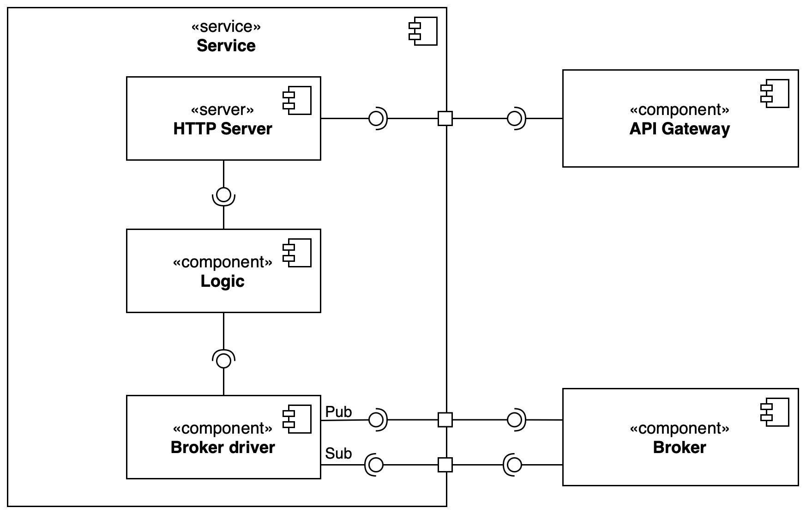
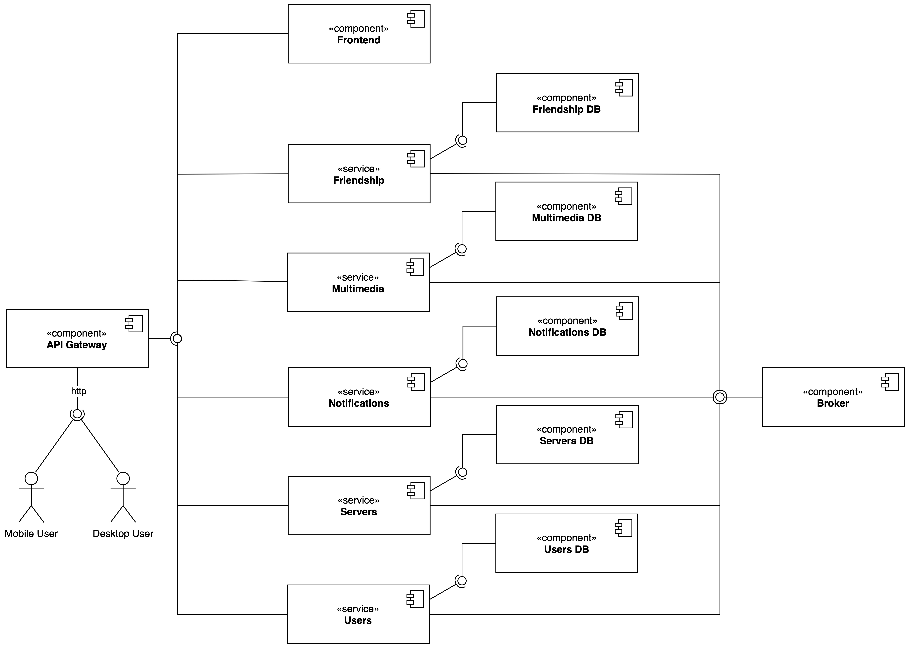
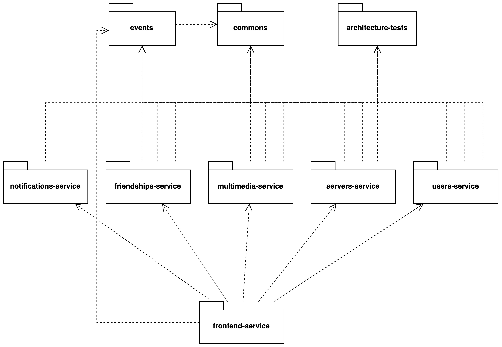
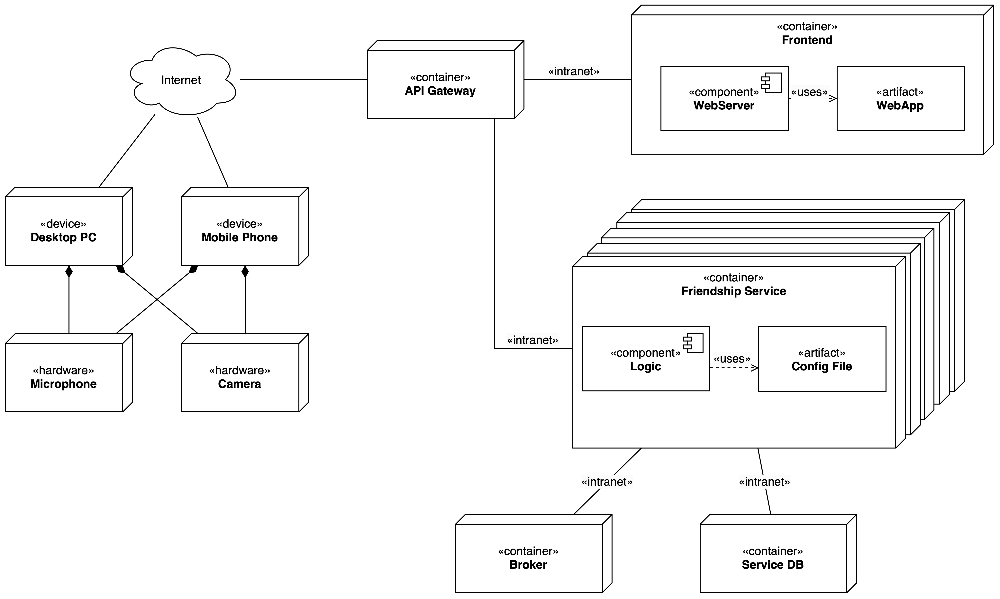

# Architecture Design

Once we identified the bounded contexts our domain, we can proceed with the design of the system architecture.

We choose to design the architecture of the our system based on the microservices architecture pattern, in order to brake down the entire complexity into smaller parts, with high cohesion, but loosely coupled.

Our choice was to map each bounded context to a microservice, in order to have a clear separation of concerns and to have a more maintainable and scalable system.
The resulting microservices are:
- `frontend-service`: responsible for serving the frontend application.
- `multimedia-service`: responsible for managing sessions.
- `servers-service`: responsible for managing servers and channels.
- `users-service`: responsible for managing users, authentication and authorization.
- `friendships-service`: responsible for managing friendships between users and their messages.
- `notifications-service`: responsible for managing notifications directed to users.

As you may notice, in the previous list, there are two more microservices, `notifications-service` and `frontend-service`, that are not directly related to the bounded contexts are necessary to provide a complete system.

## Component & Connector View

In this section you can find the component and connector view of the system, in order to give a clear view of the run-time system components and how they interact with each other.

### Database per Microservice
Each microservice, if necessary, has a database, which it can access exclusively.

### Interactions

Each microservice has two main types of interactions, in order handle communication:

- **External communication**: interactions with the outside world (e.g. client requests), which are handled by the API Gateway and redirected to the appropriate microservice.
- **Internal communication**: interactions between microservices, which are handled by the Event Broker.

### Proposed Architecture

Given the already discussed motivations, next diagram will show the proposed architecture for the system. For simplicity, the pub/sub connectors are merged together.

## Module view

The following diagram exploits the system modules, in order to give a static view of the system.

Here the list of artifacts:

- **Commons**: contains shared classes and interfaces, used by all the other modules.
- **Architecture tests**: contains common tests for architecture components, in order to adhere to our static architecture rules.
- **Events**: contains all the system events that are exchanged between modules.
- **Frontend**: contains the frontend service.
- **Friendships**: contains the friendships service.
- **Multimedia**: contains the multimedia service.
- **Notifications**: contains the notifications service.
- **Servers**: contains the servers service.
- **Users**: contains the users service.

## Deployment view

The deployment view shows the physical architecture of the system, in order to give a clear view of how the system will be deployed.
In order to design an abstract architecture, a **container-based** deployment is proposed, where each component is deployed in a container.
This allow to have a more scalable and maintainable system, given the portable nature of containers, avoiding the need to fix hardware dependencies.

Each container is composed by everything needed to correctly run the service, including the service itself and configuration file if needed.

In addition, the frontend service brings together the **Web App** accompanied by a **Web Server**, in order to serve the frontend application.

