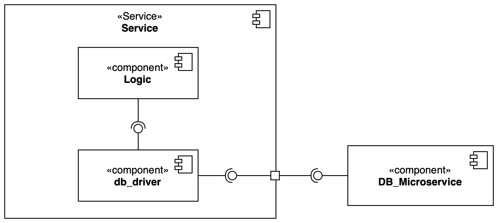

# Architecture Design

## Component & Connector View

The architecture of the system is based on the microservices architecture pattern, in order to brake down the entire complexity into smaller parts, with high cohesion, but loosely coupled.
In addition, each microservice, if necessary, has a database, which it can access exclusively.

Here is the list of microservices that compose the system:

- `frontend-service`: responsible for serving the frontend application.
- `friendships-service`: responsible for managing friendships between users and their messages.
- `multimedia-service`: responsible for managing sessions.
- `notifications-service`: responsible for managing notifications directed to users.
- `servers-service`: responsible for managing servers and channels.
- `users-service`: responsible for managing users, authentication and authorization.

### Interactions

Each microservice has two main types of interactions, in order handle communication:

- **External communication**: interactions with the outside world (e.g. client requests), which are handled by the API Gateway and redirected to the appropriate microservice.
- **Internal communication**: interactions between microservices, which are handled by the Event Broker.

### Proposed Architecture

Given the already discussed motivations, next diagram will show the proposed architecture for the system. For simplicity, the pub/sub connectors are merged together.

## Module view

The following diagram exploits the system modules, in order to give a static view of the system.

Here the list of artifacts:

- **Commons**: contains shared classes and interfaces, used by all the other modules.
- **Architecture tests**: contains common tests for architecture components, in order to adhere to our static architecture rules.
- **Events**: contains all the system events that are exchanged between modules.
- **Frontend**: contains the frontend service.
- **Friendships**: contains the friendships service.
- **Multimedia**: contains the multimedia service.
- **Notifications**: contains the notifications service.
- **Servers**: contains the servers service.
- **Users**: contains the users service.

