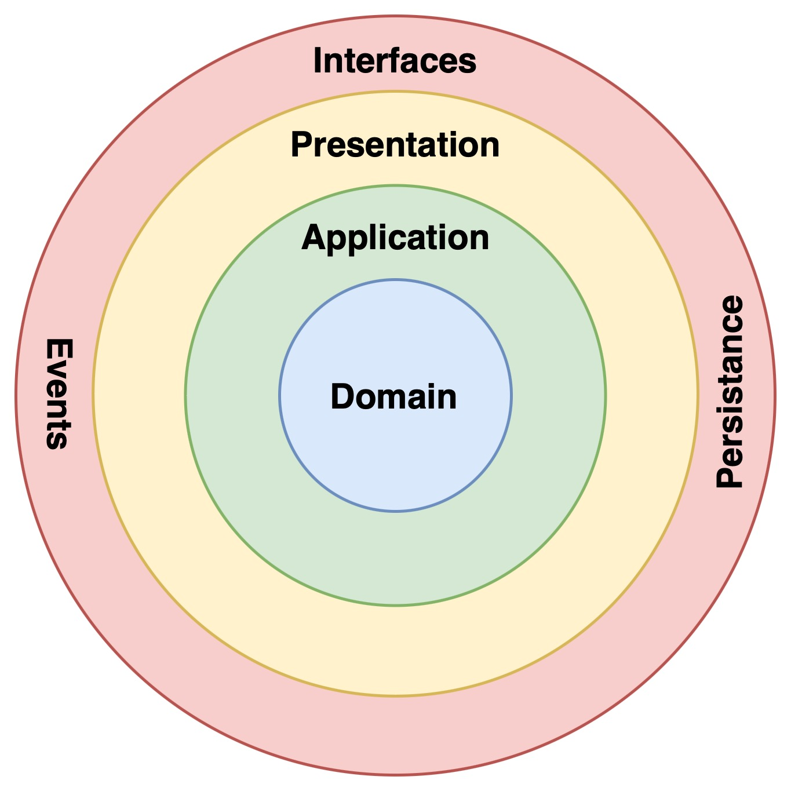
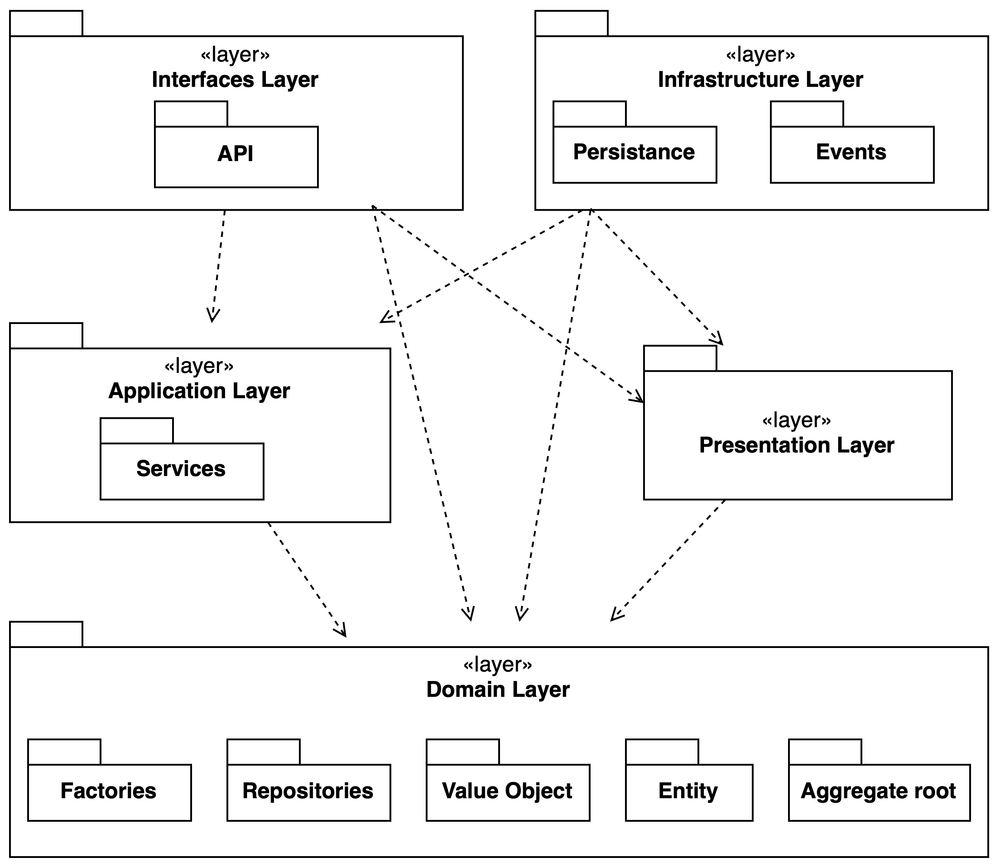

# Microservices Design

Once we have defined the application's requirements and the decomposition into services, we can proceed with the design of each microservice.

To to this, we have determined, for each service, its own API, and then we have assigned the system operations to the services.

In addiction to this, we have defined also the API for collaborating with other services.

You can find the graphical representation about this process applied to each microservice in the following sections.

## Users Microservice

### Behavior

Microservice responsible for user management and all user-related operations, including:

- Creation of users in the system (Register)
- Authentication of users in the system (Login)
- Changes to the profile of individual users in the system

## Friendships Microservice

### Behavior

Microservice responsible for managing friendships between users, including:

- Friend requests
    - Sending
    - Accepting
    - Rejecting
- Messages between friends

## Servers Microservice

### Behavior

Microservice responsible for managing servers and channels, including:

- CRUD operations on servers
- CRUD operations on channels
- Join/Leave/Kick users from server
- Sending and retrieving messages in channels

## Multimedia Microservice

### Behavior

Microservice responsible for managing multimedia sessions used to make video/audio calls, including:

- Creation of multimedia sessions
- Joining multimedia sessions
- Leaving multimedia sessions
- Managing audio and video streams

## Notifications Microservice

This microservice, as mentioned before, is a "support" microservice, that is used to push notifications to the clients and keep them updated on the status of the system.

### Behavior

Microservice responsible for managing notifications for the users, including:

- Push notifications for messages
- Push notifications for friend requests
- Updates on the online status of friends
- Updates on server and channel in which the user is a member
- Updates on friends of the user

## Frontend Microservice

### Behavior

Microservice responsible for serving the frontend of the application.

## Clean Architecture

When we designed the Microservices structure we have decided to use the **Clean Architecture** pattern, in order to separate the business logic from the technical details, making the system more maintainable, scalable and technology-agnostic.

### Layers

As mentioned before, the development of the business logic was guided from the outset, by the principles of clean architecture.
Each microservice, was designed and developed in an efficient and technology-independent manner, the code was divided into the following layers:

- _Domain Level_ (Entities, Value Objects, Aggregates, Repositories, Factories)
- _Application Level_ (Use Cases, Services)
- _Infrastructure Level_ (Technologies, Frameworks, Databases, External Services)
- _Interfaces Level_ (Controllers, SocketServers)
- _Configuration Level_ (Configuration Files)
- _Presentation Level_ (Mappers)

This approach allowed us to develop the business logic in a way that is independent of the technology used, and to be able to change it without affecting the rest of the application.

Here a conceptual diagram of the Clean Architecture:

The Clean Architecture can be exploited delving into the layers that compose the system.

Here a module view the layers that compose each microservice architecture:

### Architecture Governance

To ensure that the clean architecture constraints are respected during the development phase, we have defined a set of rules that must be followed by the developers.

This rules will be represented by a list of architectural tests that will be executed during the CI/CD pipeline. 
To see how the architectural tests are defined, please refer to the [Test-Implementation](../04-implementation/04-02-testing.md) section.