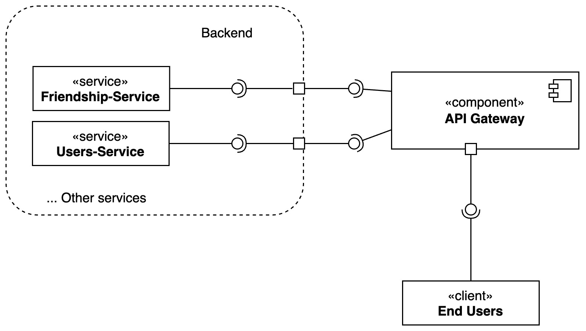
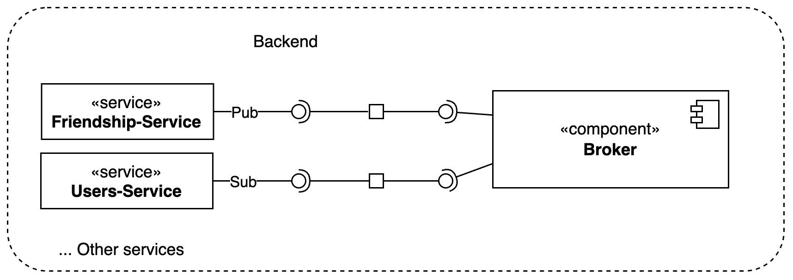
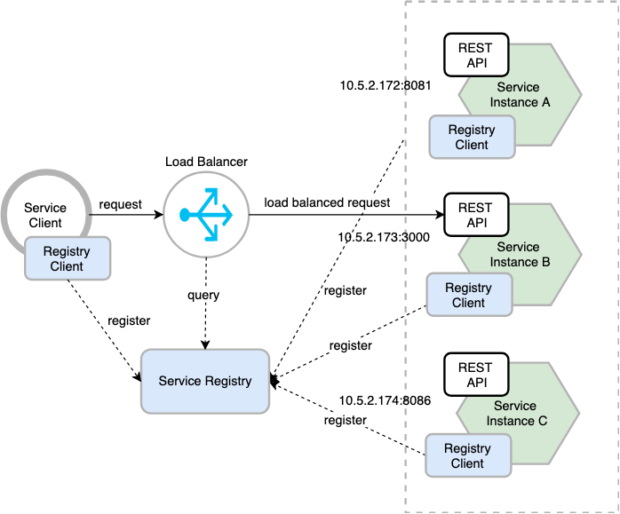
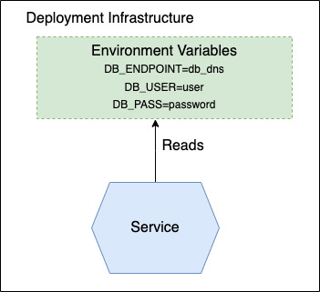

# Microservices Patterns

In this section, we will discuss some of the common patterns that we used in our microservices architecture.

## Communication Patterns

### Api Gateway

The API Gateway pattern is used to provide a single entry point for all clients. It is responsible for routing requests to the appropriate services, aggregating the responses, and returning them to the client.

It enhances scalability by efficiently managing and balancing the load on backend services, and it can scale horizontally to handle increasing traffic.

In terms of availability and reliability, the API Gateway improves the system by enabling failover mechanisms and handling service outages gracefully, often providing fallback responses or redirecting traffic to backup services.

Maintainability and observability is improved as the API Gateway centralizes cross-cutting concerns like logging and monitoring, making it easier to manage and maintain the system. This centralization simplifies the addition of new services and updates to existing ones without directly affecting clients.

### Circuit Breaker

The Circuit Breaker pattern is used to prevent cascading failures in a distributed system. It monitors the health of services and opens the circuit when a service is unavailable or slow, allowing requests to fail fast with a specific error message on what went wrong.
This allows clients to handle failures gracefully and recover when the service becomes available again.

### Event Publish/Subscribe

The Event Publish/Subscribe pattern is used to decouple services by allowing them to communicate through events. This pattern is useful when services need to be notified of changes in other services without having to make direct calls to them.
It enhances system scalability by decoupling producers and consumers of events. Producers can publish events without needing to know about the subscribers, allowing both sides to scale independently. This separation enables the system to handle increasing loads efficiently.

It enforces flexibility, as the pattern supports a dynamic and extensible architecture. New subscribers can be added without modifying the existing system, and multiple subscribers can receive the same event, enabling various parts of the system to react to changes in different ways.

In terms of performance, the Publish-Subscribe pattern improves responsiveness by enabling asynchronous communication. Producers can publish events and continue their operations without waiting for consumers to process those events. This non-blocking interaction helps to maintain system performance even during high load periods.

Reliability is enhanced through redundancy and fault tolerance. Events can be persisted and replayed in case of failures, ensuring that important information is not lost and that the system can recover gracefully from disruptions.

---

## Deployments Patterns

### Service as Containers

The Service as Containers pattern is used to package services as containers. This pattern allows services to be deployed in a consistent and reproducible way, making it easier to manage and scale them, as containerized services can be easily scaled horizontally to handle increased load.

It improve Isolation, where each service runs in its own container, isolated from other services and portability, given the fact that containers encapsulate all dependencies and configurations required by a service, making it easy to deploy the service across different environments.

Maintainability is enhanced through the use of containers, as they enable a microservices architecture where each service can be developed, tested, and deployed independently and, in addition, modularity simplifies the development process, allowing teams to focus on individual services without worrying about the impact on the overall system.

Efficiency is another benefit, as containers share the same operating system kernel and consume fewer resources compared to traditional virtual machines.

### Database per Service

The Database per Service pattern allows each service to have its own database, which is isolated from others. It enhances scalability by allowing each service to scale its database independently, optimizing resource allocation and performance. Isolation improves security given the fact each service manages its own data separately.

Maintainability is improved since services can evolve independently, choosing the most suitable database technology without affecting others.

### Service Discovery

The Service Discovery pattern is used to dynamically discover services at runtime. This pattern allows services to find and communicate with each other without having to know their IP addresses or ports.

The system uses a **Deployment-level Service Discovery** where services register themselves with a service registry when they start up and deregister when they shut down. The service registry is used by clients to discover services and make requests to them.
A **DNS** resolver is used to resolve service names to IP addresses.
It involves:
- **Registration pattern** where services register themselves with a service registry when they start up and deregister when they shut down.
- **Discovery pattern** where clients use the service registry to discover services and make requests to them.

This pattern allows services to be deployed and scaled independently of each other, facilitating the addition and removal of service instances without manual intervention.
It improves reliability and availability are improved because the pattern supports automatic failover. If a service instance becomes unavailable, the discovery mechanism can redirect requests to healthy instances, ensuring continuous operation and minimizing downtime.

Flexibility is another benefit, as services can change their network locations without affecting the system. The discovery service updates the network locations of services automatically, and maintainability is improved, as the dynamic nature of service discovery reduces the need for hardcoded configurations. This makes it easier to update and manage services, simplifying the overall system maintenance.

### Configurable Service

The Configurable Service pattern is used to configure services with all the necessary information at runtime.
This pattern allows to create services that can be easily adapted to different environments and configurations without having to make changes to the code, enhancing flexibility and maintainability.
Services are shipped with a default configuration that can be overridden by environment variables or configuration files during the deployment process, in a **push-based externalized configuration**.

Security is improved by centralizing sensitive configuration data, such as credentials and API keys, and managing access controls more effectively. This reduces the risk of exposing sensitive information in the service code.

    

---

## Observability Patterns

### Health-check API

The Health-check API pattern is used to provide a way for services to report their health status. This pattern is useful for monitoring the health of services and detecting issues before they become critical.

Each service exposes an endpoint that returns its health status and Deployment-level Health Checks are used to monitor the health of services and take action if needed.

Two health checks types have been analyzed:

- **Liveness**: to collect the service status. If it will fail for a certain amount of times, the service will be restarted.
- **Readiness**: service temporarily unable to serve traffic should not to be restarted, but just slow down the requests to it.

It enhances system reliability by allowing services to regularly report their operational status. This proactive monitoring ensures that potential issues are detected early, minimizing downtime and maintaining high availability. It improve scalability as the health-check endpoints allow load balancing to make informed decisions about routing traffic. Services that report healthy states can receive more requests, while those in a degraded state can be automatically isolated or receive less traffic, optimizing resource usage.

Maintainability is significantly enhanced by providing a standardized way to monitor and manage service health.

### Log aggregation

The Log Aggregation pattern is used to collect and store logs from services in a centralized location. This pattern allows to monitor the health of services, detect issues, and troubleshoot problems, enhancing system observability and maintainability by consolidating logs from multiple services and components into a centralized location.

### Application Metrics

The Application Metrics pattern is used to collect and store metrics from service and deployment system. This pattern allows to monitor the performance of services, detect bottlenecks, and optimize the system, enhancing system observability by collecting and aggregating performance data from various components and services within an application.

---

## Security Pattern

### Access Token

The Access Token pattern is used to secure communication between services. This pattern involves issuing access tokens to services that are used to authenticate and authorize requests.

This pattern allows services to verify the identity of other services and control access to resources.

It enhances security by enabling controlled and secure access to resources. Access tokens serve as temporary credentials that grant specific permissions to users or applications, reducing the risk of unauthorized access.

Scalability is also improved as access tokens can be issued and verified independently, allowing services to handle authentication and authorization requests efficiently. This decentralization supports horizontal scaling by distributing the load across multiple instances, accommodating increasing numbers of users and requests.

Flexibility is another benefit, as access tokens can encapsulate different scopes and permissions. Services can validate tokens to enforce fine-grained access control, allowing users or applications to access only the resources and functionalities they are authorized for.

It also improve reliability through token expiration and revocation mechanisms. Access tokens have limited validity periods and can be revoked if compromised or no longer needed, minimizing the impact of security breaches and ensuring continuous protection of resources.
