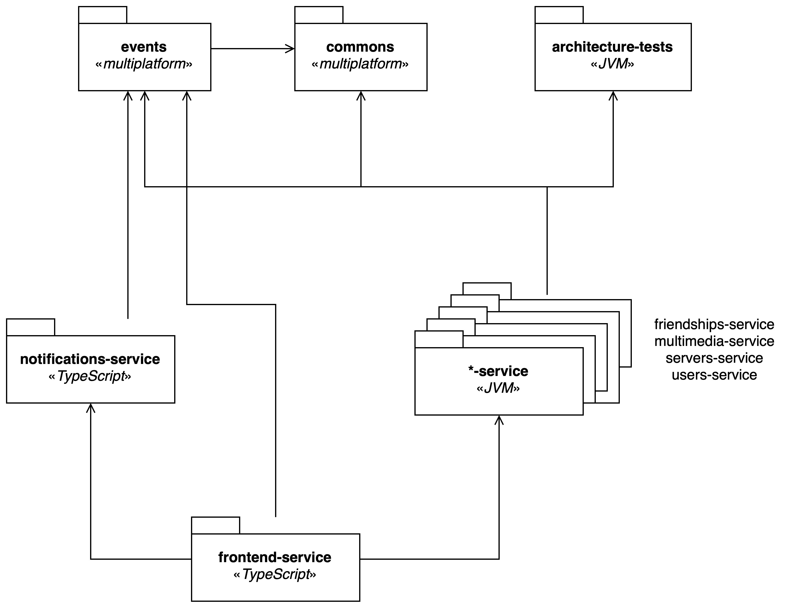

# Implementation

This section describes the implementation of the project.
It will focus on particular aspects of the project.

## Package Structure

The project is divided into multiple modules, the following figure shows the package structure and the code dependencies between the modules.



## DDD Abstractions

The project is based on the principles of Domain-Driven Design (DDD).
We have defined the following abstractions to model the tactical patterns of DDD:

### Entity Id

```kotlin
open class EntityId<Id>(open val value: Id) {
    override fun equals(other: Any?): Boolean {}
    override fun hashCode(): Int {}
}
```

It is a generic class that represents the identity of an entity.

### Entity

```kotlin
open class Entity<Id : EntityId<*>>(open val id: Id) {
    override fun equals(other: Any?): Boolean {}
    override fun hashCode(): Int {}
}
```

It is a generic class that represents an entity.
It is generic on the type of the identity of the entity and it has a reference to the identity.
The equality of entities is based on the identity.

### Value Object

```kotlin
interface ValueObject
```

It is an interface that represents a value object.
It's of course empty, but it's useful to mark the value objects in the code.

### Aggregate Root

```kotlin
open class AggregateRoot<Id : EntityId<*>>(id: Id) : Entity<Id>(id)
```

It is a generic class that represents an aggregate root.
It is generic on the type of the identity of the aggregate root and it extends the entity class.

### Repository

```kotlin
interface Repository<Id : EntityId<*>, E : AggregateRoot<Id>> {
    fun findById(id: Id): E?

    fun save(entity: E)

    fun deleteById(id: Id): E?

    fun update(entity: E)

    fun deleteAll()
}
```

It's the simplest abstraction that represents a repository.
It should only work with aggregate roots and have the basic CRUD operations.
Only find methods should be added when generating a new repository.

### Factory

```kotlin
interface Factory<E : Entity<*>>
```

Like the Value Object interface, it's an empty interface, but it's useful to mark the factories in the code.
