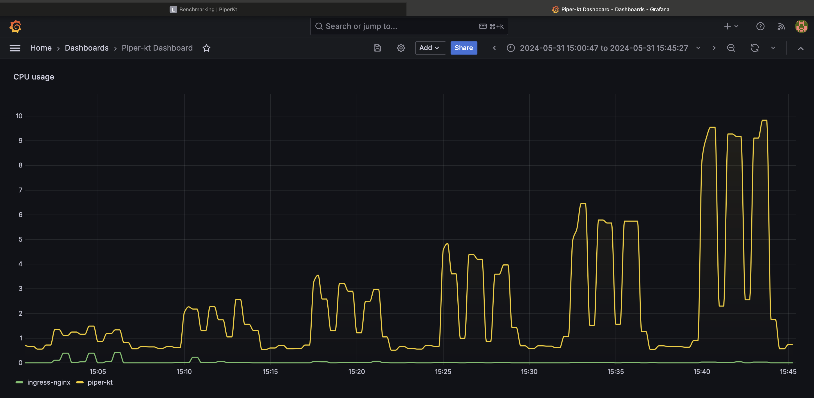

# Monitoring

## Health checks

Health checks have been configured in the system.

The following two components have been set up, in order to exploit mechanism properties.

### Service side

Microservice have been configure to handle `/health` requests.
For Micronaut microservices, it has been used the [Health Checks Module](https://micronaut-projects.github.io/micronaut-kubernetes/snapshot/guide/), that allow to automatic implement this functionality.

### Client side

The client side of health check is been improved using [Kubernetes Probe Mechanism](https://kubernetes.io/docs/tasks/configure-pod-container/configure-liveness-readiness-startup-probes/). This allows to define request that will be performed to service and take action if needed.

Two different probe have been defined.

- **Liveness**: liveness probe are sent to service in order to collect it's status. If it will fail for a certain amount of times, the microservice will be restarted.
- **Readiness**: applications temporarily unable to serve traffic for example that might need to load large data or configuration files during startup, or depend on external services after startup should not to be killed, but just sending requests to other replicas.

## Metrics

Metrics server have been improved adding [Prometheus](https://prometheus.io) and [Grafana](https://grafana.com) service to the system.

The configuration has been improved using the [Kubernetes Prometheus Operator](https://prometheus-operator.dev), that allows a direct integration and predefined metrics extracted from Kubernetes.

### Prometheus

Many tries have been made in order to explore a bit `PromQL`, Prometheus query language for extracting metrics and aggregating the samples.

Here an example of query:

```promql
sum by (namespace) (rate(container_cpu_usage_seconds_total{namespace=~"piper-kt|ingress-nginx"}[1m]))
```

- rate(container_cpu_usage_seconds_total{namespace=~"piper-kt|ingress-nginx"}[1m]):
    - container_cpu_usage_seconds_total: a metric that tracks the total CPU usage time in seconds for containers.
    - {namespace=~"piper-kt|ingress-nginx"}: a label matcher that filters the metric to include only those time series where the namespace label matches either piper-kt or ingress-nginx. The =~ operator is a regex match operator.
    - [1m]: This specifies the time range of 1 minute. The query is looking at the CPU usage over the past 1 minute.
    - rate(...): function that calculates the per-second average rate of increase of the time series in the specified range. Essentially, it gives the rate of CPU usage per second over the past minute.
- sum by (namespace): function calculates the sum of the values, with clause specifies that the sum should be grouped by the namespace label. This means it will aggregate the CPU usage rate per namespace.

### Grafana

Grafana has been you in order to plot metrics in a user friendly way.

Metrics are retrieved by Prometheus, and it gives the ability to directly display base metrics or calculate complex PromQL queries.

Here an example of a Grafana view that create a friendly chart about the query described above.

The Grafana dashboard can be found [here](https://github.com/zucchero-sintattico/piper-kt/blob/fa3983c8354d947ceb4c1943f763c433f6ebfbfa/resources/benchmark-scripts/cpu-usage-dashboard.json).



## Logging

For the logging and debug part, has been used the [Kubernetes Logging Architecture](https://kubernetes.io/docs/concepts/cluster-administration/logging/).

It allows to aggregate logs and views logs of crashed pods.
