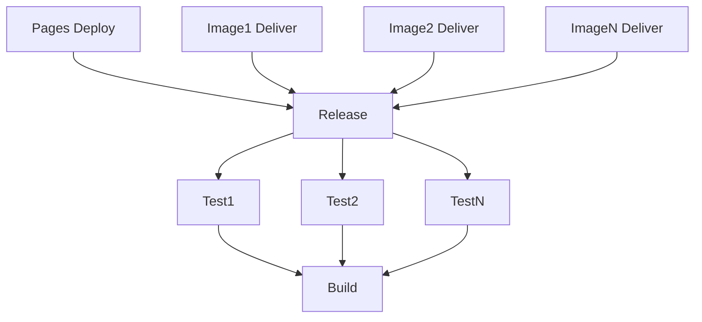

# CI / CD

The Continuous Integration (CI) and Continuous Deployment (CD) processes are essential parts of a DevOps software development lifecycle.

During the CI process, the code is automatically built, tested, and analyzed every time a developer pushes code to the repository. This process helps to catch bugs early in the development cycle and ensures that the codebase is always in a deployable state.

The project uses [GitHub Actions](https://github.com/features/actions) to realize a CI/CD process. GitHub Actions is a powerful tool that allows automating the software development workflow directly in the GitHub repository.

## CI / CD Action

The file `.github/workflows/ci-cd.yml` contains the configuration for the entire CI/CD process.
This action performs build, test, release, delivery and deployment tasks.

Here a conceptual overview of the CI/CD process (arrow means depends on):

### Build

The build job compiles the source code and run all checks.
This part allows to stop the process instead of spawning multiple matrix jobs for testing.

### Intensive Tests

The tests job runs all the tests already run before, but with a different configuration.
It uses a matrix strategy to run the tests in parallel.

> **Note**: Given the fact project uses testcontainers they could not be run on MacOS or Windows runners.

### Release

The release job is the one responsible for determining if the code should be released.
Using semantic release task, it will compute the next version (if needed), create a new tag, and push it to the repository.
Obviously, it will also create a release on GitHub.
