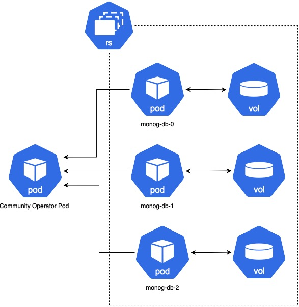
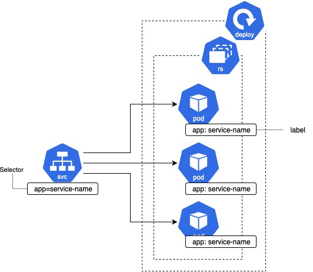

# Deployment Overview

To deploy the application, we use Kubernetes, a container orchestration platform that automates the deployment, scaling, and management of containerized applications

## Namespace

Namespaces are intended for use in environments with many users spread across multiple teams, or projects. For clusters with a few to tens of users, you should not need to create or think about namespaces at all [Namespace Doc](https://kubernetes.io/docs/concepts/overview/working-with-objects/namespaces/). For that reason, the application is fully deployed in the `piper-kt` namespace.

## Operator

Operators extend the functionalities of Kubernetes, allowing the definition of new custom resource types to manage application resources. The following operators are used:

- **Strimzi Kafka Operator**: essential for managing Kafka instances on Kubernetes. Using Helm for deployment, we can configure Kafka with ease, managing complex clusters without having to write detailed configurations.  Helm chart [here](https://github.com/strimzi/strimzi-kafka-operator/tree/main/helm-charts/helm3/strimzi-kafka-operator).
- **MongoDB Operator**: ensures that MongoDB instances are always available and properly configured, while also managing failover and replication to ensure high availability and resilience. Helm chart [here](https://github.com/mongodb/helm-charts/tree/6ddf86b1b00cdd807840de36fc97b91466ee6981/charts/community-operator).



## NGINX Ingress Controller

The NGINX Ingress Controller manages traffic and was installed using Helm. It is configured to handle traffic to the services exposed by the application. Ingress Controller Helm chart [here](https://github.com/kubernetes/ingress-nginx/tree/main/charts/ingress-nginx).

## Dependencies between Components

The various pods are interdependent; for example, the Micronaut microservices cannot send messages without Kafka. However, Kubernetes does not require that pods start in a specific order; it handles the startup of pods independently and restarts them in case of crashes. This simplifies deployment and enhances resilience to component failures as described in the [documentation](https://kubernetes.io/docs/concepts/overview/).

## Structure

The piper-kt namespace contains all the services of the application.Each application component is a containerized microservice, managed and potentially scalable by Kubernetes.
The Kubernetes-based architecture described allows each component to scale independently, improve system resiliency, and facilitate maintenance and upgrading of individual services.




## Deployment Steps

### Resources

For the system to run smoothly and efficiently, the virtual machine must have at least 8 CPUs and 32 GB of RAM. This is to ensure that all services are running and kubenertes does not decide to delete some pods due to lack of resources. The system will also start up with fewer resources, but some pods may not keep the running state, causing malfunctions.

### Prerequisites

The deployment process relies on several dependencies:

- **Kubernetes Cluster**: A running Kubernetes cluster is required, such as a local development cluster (like Minikube or Kind). If using Minikube, run the command 

```bash
minikube start --cpus 8 --memory 32000
```

- **kubectl**: The `kubectl` command-line tool must be installed and configured to interact with the Kubernetes cluster.[here](https://kubernetes.io/docs/tasks/tools/).
- **Helm**: Helm, the package manager for Kubernetes, is used to manage the deployment of certain components, such as MongoDB and the Strimzi Kafka Operator. Installation instructions can be found [here](https://helm.sh/docs/intro/install/).

### Why Helm?

Helm is a package manager for Kubernetes that allows the definition of complex applications using a templating system. This the installation of multiple components that share the same configuration with different values.

### Launch the Deployment

1. Clone the repository with the command

    ```bash
    git clone https://github.com/zucchero-sintattico/piper-kt.git
    ```

2. Navigate to the folder

    ```bash
    cd piper-kt
    ```

3. Run the deploy command to start the deployment process.

    ```bash
    ./scripts/deploy.sh
    ```

The deployment process may take several minutes depending on the cluster's performance and internet connection. At the end of the process, the application will be available at `http://localhost:8080`.

If the deployment process is successful, you should see the following pods running with the command `kubectl get pods -n piper-kt`:

```shell
NAME                                        READY   STATUS     RESTARTS    AGE
cluster-broker-0                            1/1     Running    ...         ...
cluster-controller-1                        1/1     Running    ...         ...
cluster-entity-operator-xxx                 2/2     Running    ...         ...
friendships-mongo-0                         2/2     Running    ...         ...
friendships-service-xxx                     1/1     Running    ...         ...
frontend-service-xxx                        1/1     Running    ...         ...
mongo-operator-service-xxx                  1/1     Running    ...         ...
multimedia-mongo-0                          1/2     Running    ...         ...
multimedia-service-xxx                      1/1     Running    ...         ...
notifications-mongo-0                       2/2     Running    ...         ...
notifications-service-xxx                   1/1     Running    ...         ...
servers-mongo-0                             1/2     Running    ...         ...
servers-service-xxx                         1/1     Running    ...         ...
strimzi-cluster-operator-xxx                1/1     Running    ...         ...
users-mongo-0                               1/2     Running    ...         ...
users-service-xxx                           1/1     Running    ...         ...
```

Other useful commands to monitor the cluster status are:

- `kubectl get pods -n piper-kt` to see the running pods.
- `kubectl get services -n piper-kt` to see the exposed services.
- `kubectl describe ingress` to see the ingress configurations.

## Cleanup

To remove the application from the cluster, run the command `./scripts/undeploy.sh`. This script will remove all the resources created during the deployment process.
