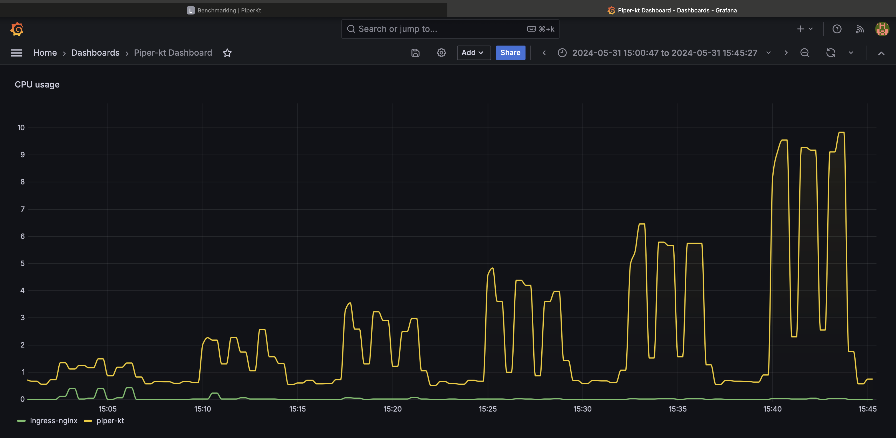

# Benchmarking

Benchmarking is the process of measuring the performance of a system.
It is a critical step in the development of any software system, as it allows developers to identify bottlenecks and performance issues early in the development process.
Benchmarking can also be used to compare the performance of different systems or different versions of the same system.

## HTTP Benchmarking

The following tests are performed in order to stress the system to verify that horizontal scalability brings some of the expected results: increasing the number of requests handled over a given period.

This test consists of running the same client-side workload by varying the number of replicas of the service that must handle them.

### Tools & Setup

The scenario involves a client making HTTP requests to the server, where the Piper-kt software is running, inside a Kubernetes cluster provided by Minikube.

#### Hardware

| Machine | O.S          | CPU                       | RAM  | Link        |
| ------- | ------------ | ------------------------- | ---- | ----------- |
| Client  | Ubuntu 22.04 | Intel Core i7-8700 6 core | 48GB | 1Gbps (LAN) |
| Server  | macOS 14.5   | Apple M1 Pro              | 16GB | 1Gbps (LAN) |

The Kubernetes cluster is running on a single-node Minikube instance, with the following configuration:

```bash
$ minikube start --cpus 8 --memory 32g
```

Pod under test has the following resources configuration:

```yaml
requests:
    memory: "512Mi"
    cpu: "500m"
limits:
    memory: "2048Mi"
    cpu: "1000m"
```

#### Client Software

The tool used to make client-side HTTP requests is [wrk](https://github.com/wg/wrk), a benchmarking software that allows significant workloads to be generated, taking advantage of a single multi-core CPU.

Microservice under test is `users-service`, focussing on /auth/login route, tested with the credentials of an already registered user, through the following configuration:

```lua
-- resources/benchmark-scripts/post.lua
wrk.method = "POST"
wrk.body = '{"username": "manuandru", "password": "12341234"}'
wrk.headers["Content-Type"] = "application/json"
```

```bash
$ wrk -t10 -c150 -d30s http://<server-ip>/auth/login -s ./post.lua
```

- `-t10`: 10 threads
- `-c150`: 150 simultaneous connections
- `-d60s`: 60 seconds of test

### Results

The test has been performed with 1, 2, 3, 4, 6 and 10 replicas of the `users-service` microservice.
Each test has been executed 3 times, and results are the mean of the 3 runs.
Between each run there is a sleep of 30 seconds and between scaling up the replicas there is a sleep of 180 seconds.

The script can be found in `resources/benchmark-scripts/test.sh`, executed with the following arguments:

```bash
$ ./test.sh cluster_address 3 http://<server-ip>/auth/login 1 2 3 4 6 10
```

| Replicas | Successful Requests | Successful Requests per seconds |
|----------|:-------------------:|:-------------------------------:|
| 1        |         617         |              10.28              |
| 2        |        1112         |              18.53              |
| 3        |        1848         |              30.80              |
| 4        |        3313         |              55.13              |
| 6        |        5319         |              88.49              |
| 10       |        8151         |             135.61              |

The results show that the system is able to scale horizontally, as the number of successful requests per second increases as the number of replicas increases.

### CPU usage

During the test has been monitored the CPU usage of containers, using `Prometheus` with the following query:

```promql
sum by (namespace) (rate(container_cpu_usage_seconds_total{namespace=~"piper-kt|ingress-nginx"}[1m]))
```

The results show the CPU usage of the containers inside the `piper-kt` and `ingress-nginx` namespaces and aggregated, summarizing metrics by 1 minutes.

The query has been also displayed with `Grafana`, showing the following results:

Grafana dashboard is in `resources/benchmark-scripts/cpu-usage-dashboard.json`.


