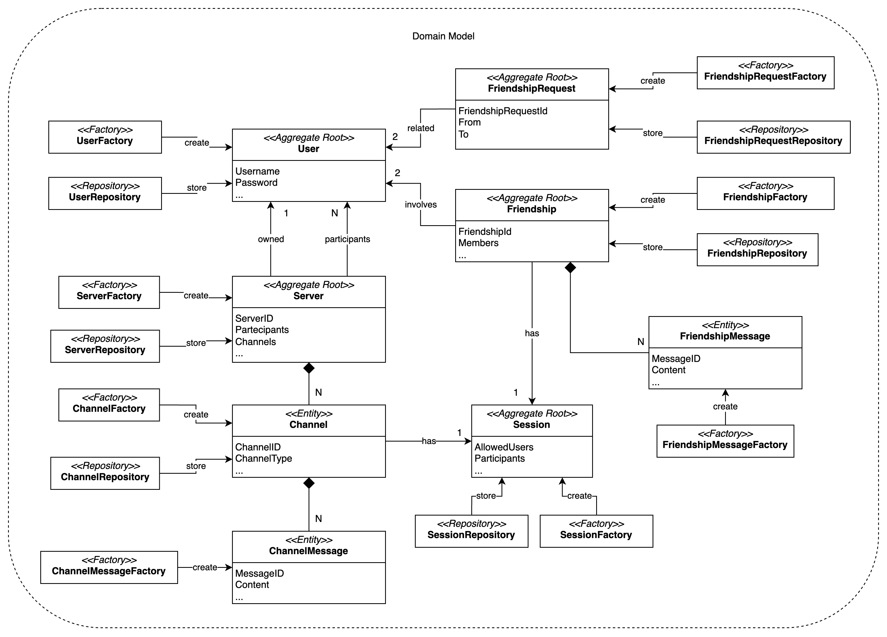

# Domain Model

Here is the domain model of the system. It is a high-level representation of the system's entities and their relationships.

The details about each entity attributes has been omitted for simplicity.

